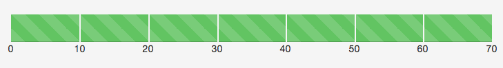

bootstrap-progress-labels
=========================

Add scaled numeric labels to Twitter Bootstrap progress bar components:



Usage:
---

Simply install bootstrap.progress-bar-labels.js in your application with a script tag (after loading Twitter Bootstrap javascripts):

``` html 
	<script src="bootstrap.progress-bar-labels.js"></script>
```

And then start adding labels to your progress bars, by adding the following attributes:

* **class**: `"progress progress-labelled"` (using progress-labelled means that labels are automatically added to the progress bar)
* **data-label-max**: The upper bound of the scale - e.g. 100. Must be present, and be a number.
* **data-label-scale**: The number to increment for each label - e.g. 10. Must be present, and be a number.
* **data-label-append**: Is appended to the labels numbering - e.g. "1 Thingy" (also nice with fa-icons appended)

Contribution:
---

This plugin is written using [Coffeescript](http://coffeescript.org). Please **do not change the Javascript files, as they are automatically generated**. Instead, change the .coffee files in the 'coffee' directory, and compile them to Javascript. Personally, I use the following command:

``` bash
coffee -cwo . coffee
```

Each time you change the plugin, be sure to open the Jasmine unit tests (`open spec/SpecRunner.html`), and make sure everything still passes.

License:
---

Copyright (c) 2013 Josh McArthur

Permission is hereby granted, free of charge, to any person obtaining a copy of this software and associated documentation files (the "Software"), to deal in the Software without restriction, including without limitation the rights to use, copy, modify, merge, publish, distribute, sublicense, and/or sell copies of the Software, and to permit persons to whom the Software is furnished to do so, subject to the following conditions:

The above copyright notice and this permission notice shall be included in all copies or substantial portions of the Software.

THE SOFTWARE IS PROVIDED "AS IS", WITHOUT WARRANTY OF ANY KIND, EXPRESS OR IMPLIED, INCLUDING BUT NOT LIMITED TO THE WARRANTIES OF MERCHANTABILITY, FITNESS FOR A PARTICULAR PURPOSE AND NONINFRINGEMENT. IN NO EVENT SHALL THE AUTHORS OR COPYRIGHT HOLDERS BE LIABLE FOR ANY CLAIM, DAMAGES OR OTHER LIABILITY, WHETHER IN AN ACTION OF CONTRACT, TORT OR OTHERWISE, ARISING FROM, OUT OF OR IN CONNECTION WITH THE SOFTWARE OR THE USE OR OTHER DEALINGS IN THE SOFTWARE.

